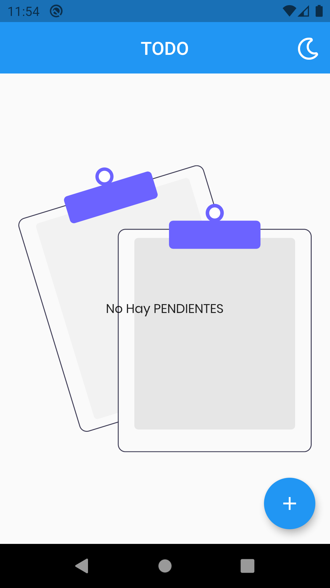
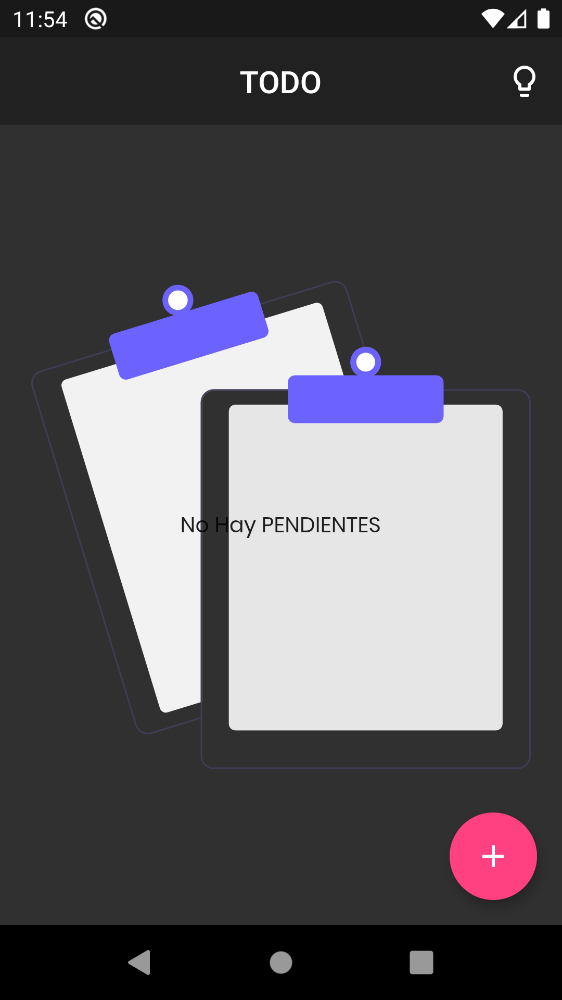
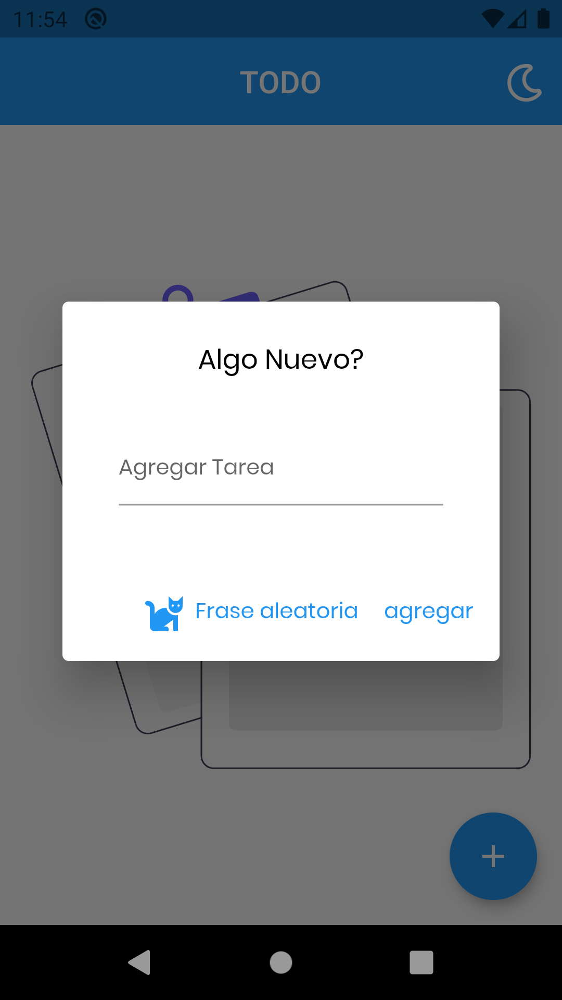
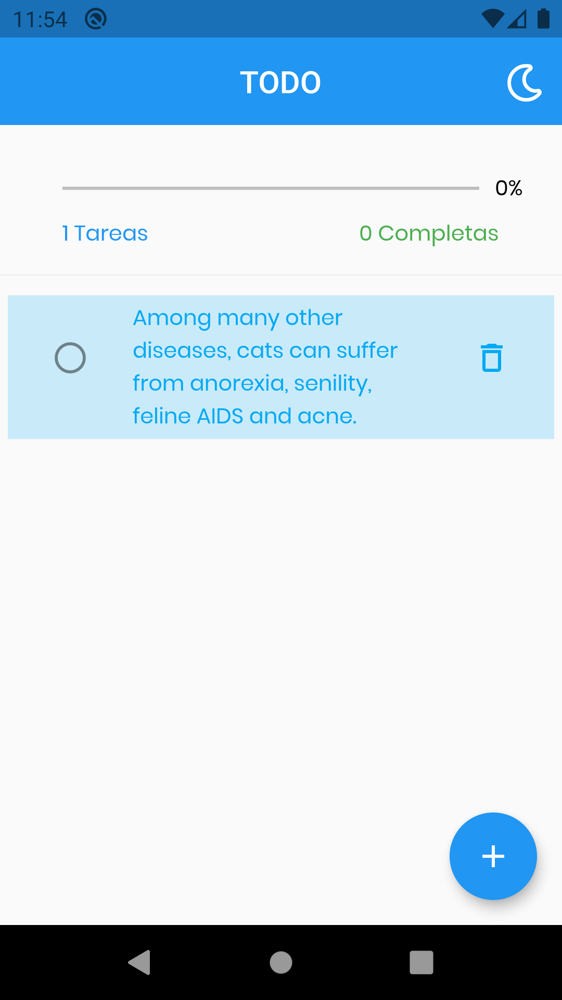
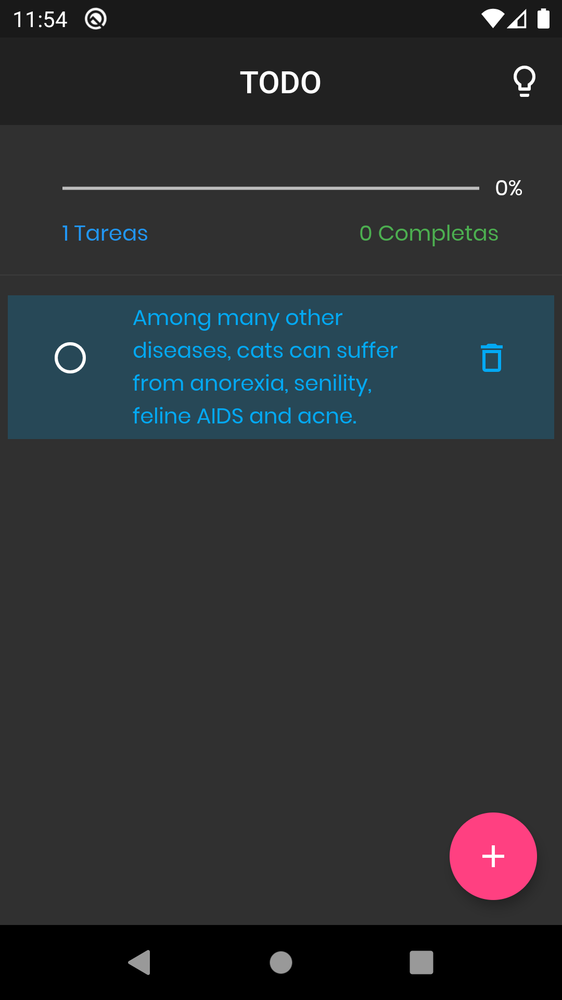

# todo

## Flutter TODOAPP

  

  <table>
    <thead>
      <tr>
        <th><Strong>TODO</Strong></th>
      </tr>
    </thead>
    <tbody>
        <tr>
            <td> </td>
            <td> </td>
        </tr>
        <tr>
           <td> </td>
            <td> </td>
        </tr>
        <tr>
           <td> </td>
            <td> </td>
        </tr>
    </tbody>
  </table>